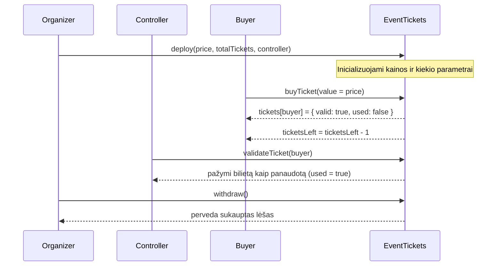

# Event Tickets DApp

Decentralizuota bilietų pardavimo sistema Ethereum tinkle. Modelyje dalyvauja trys šalys:
- Organizatorius (sutarties savininkas, gauna lėšas)
- Kontrolierius (tikrina/validuoja bilietus renginio metu)
- Pirkėjas (įsigyja bilietą)

Projektas įgyvendintas su Solidity (Truffle), testuojamas lokaliai (Ganache) ir gali būti diegiamas į viešą testinį tinklą (pvz., Sepolia). Pridėtas minimalistinis Front‑End, leidžiantis jungtis su MetaMask, pirkti/validuoti bilietus ir išsiimti lėšas.

## Verslo Modelis ir Logika

- **Tikslas:** saugus bilietų pardavimas su atskirtomis atsakomybėmis: pirkimas (pirkėjas), validacija (kontrolierius), lėšų atsiėmimas (organizatorius).
- **Pagrindiniai veikėjai:**
  - Organizatorius: diegia sutartį, nustato kainą, bilietų skaičių, kontrolieriaus adresą, atsiima lėšas.
  - Kontrolierius: turi teisę validuoti ("panaudoti") pirkėjų bilietus renginyje.
  - Pirkėjas: perka 1 bilietą savo adresu už fiksuotą kainą.
- **Taisyklės:**
  - Kiekvienas adresas gali turėti 1 bilietą (neleidžiami dubliai).
  - Bilietų skaičius ribotas: `ticketsLeft` mažėja pirkimo metu.
  - Bilieto validaciją gali atlikti tik `controller` (kontrolierius).
  - Lėšas gali atsiimti tik `organizer` (organizatorius).

### Sekų diagrama (Sequence Diagram)



### Tipiniai scenarijai

1) Pirkimas:
- Pirkėjas per MetaMask siunčia `buyTicket()` su `value = ticketPrice`.
- Jei bilietai pasibaigę, kaina neteisinga arba pirkėjas jau turi bilietą — tranzakcija atmetama.

2) Validacija:
- Kontrolierius (sutartyje nurodytas `controller`) kviečia `validateTicket(buyer)`.
- Jei bilietas negaliojantis arba jau panaudotas — atmetama.

3) Lėšų atsiėmimas:
- Organizatorius kviečia `withdraw()` ir gauna visą sutartyje sukauptą balansą.

## Išmanioji sutartis

Failas: `contracts/EventTickects.sol` (sutartyje `contract EventTickets`).

Pagrindiniai kintamieji ir struktūros:
- `organizer` (address): sutarties diegėjas/savininkas.
- `controller` (address): kontrolierius, turintis teisę validuoti bilietus.
- `ticketPrice` (uint): bilieto kaina wei vienetais.
- `ticketsLeft` (uint): likusių bilietų skaičius.
- `Ticket { bool valid; bool used; }`: bilieto būsena.
- `mapping(address => Ticket) tickets`: bilietai pagal pirkėjo adresą.

Pagrindinės funkcijos:
- `constructor(uint _price, uint _tickets, address _controller)`: nustatyti kainą, kiekį ir kontrolierių.
- `buyTicket() external payable`: perka bilietą už tikslią kainą, mažina `ticketsLeft`, žymi bilietą pirkėjui.
- `validateTicket(address _buyer) external`: leidžiama tik `controller`, pažymi `_buyer` bilietą kaip panaudotą.
- `withdraw() external`: leidžiama tik `organizer`, perveda kontrakto balansą organizatoriui.

> Pastaba: dabartinėje pradinėje versijoje konstruktorius turi priimamus parametrus, tačiau būtinai įsitikinkite, kad jie priskiriami atitinkamiems kintamiesiems (`ticketPrice`, `ticketsLeft`, `controller`). Testai šį elgesį tikrina (žr. `test/EventTickets.test.js`).

## Projekto struktūra

```
truffle-config.js
build/
  contracts/
    EventTickets.json
contracts/
  EventTickects.sol
frontend/
  app.js
  index.html
  style.css
migrations/
  1_deploy_event_tickets.js
test/
  EventTickets.test.js
```

## Lokalus darbas (Ganache + Truffle)

### Priešreikalavimai
- Node.js LTS
- Truffle (`npm i -g truffle`)
- Ganache (programa) arba `npx ganache`
- MetaMask naršyklėje

### 1) Paleiskite lokalią grandinę
```bash
npx ganache --wallet.seed "test test test test test test test test test test test junk" --chain.networkId 5777 --miner.blockGasLimit 8000000
```
Arba naudokite Ganache GUI ir įsitikinkite, kad veikia ant `127.0.0.1:8545`.

### 2) Kompiliuokite ir diekite lokaliai
```bash
truffle compile
truffle migrate --network development
```
`truffle-config.js` jau sukonfigūruotas `development` tinklui (127.0.0.1:8545).

### 3) Paleiskite testus
```bash
truffle test
```
Testai tikrina: inicializaciją, bilieto pirkimą, validaciją, lėšų atsiėmimą ir apsaugas nuo klaidų.

## Diegimas į Sepolia (testnet)

### 1) Įdiekite priklausomybę
```bash
npm i -D @truffle/hdwallet-provider
```

### 2) Pridėkite konfigūraciją (`truffle-config.js`)

```js
const HDWalletProvider = require('@truffle/hdwallet-provider');

module.exports = {
  networks: {
    development: { host: '127.0.0.1', port: 8545, network_id: '*', gas: 8000000, gasPrice: 20000000000 },
    sepolia: {
      provider: () => new HDWalletProvider({ mnemonic: process.env.MNEMONIC, providerOrUrl: process.env.SEPOLIA_RPC_URL }),
      network_id: 11155111,
      gas: 8000000,
      confirmations: 2,
      timeoutBlocks: 200,
      skipDryRun: true
    }
  },
  compilers: { solc: { version: '0.8.20' } }
}
```

### 3) Nustatykite aplinkos kintamuosius
```bash
$env:MNEMONIC="jūsų 12 žodžių frazė"   # PowerShell pavyzdys Windows
$env:SEPOLIA_RPC_URL="https://sepolia.infura.io/v3/<API_KEY>"  # arba Alchemy URL
```

### 4) Diekite
```bash
truffle migrate --network sepolia
```

### 5) Etherscan peržiūra
- Nukopijuokite diegtos sutarties adresą iš `migrate` išvesties.
- Apsilankykite https://sepolia.etherscan.io/ ir įklijuokite adresą.
- Skiltyje „Transactions“ matysite pirkimų, validacijų ir atsiėmimų logus.
- Papildomai galite "Verify & Publish" kontraktą (pasirinkite kompiliatoriaus versiją `0.8.20`).

## Front‑End naudojimas

Failai: `frontend/index.html`, `frontend/app.js`, `frontend/style.css`.

1) Atnaujinkite kontrakto adresą `frontend/app.js`:
```js
const contractAddress = "<JŪSŲ_DIEGIMO_ADRESAS>";
```
2) Paleiskite paprastą statinį serverį:
```bash
npx serve frontend
# arba
npx http-server frontend -p 8080
```
3) Naršyklėje atverkite adresą, prisijunkite MetaMask, pasirinkite tinklą (Localhost 8545 ar Sepolia) ir:
- „Buy Ticket“ – perka bilietą už `ticketPrice`.
- „Validate Ticket“ – įveskite pirkėjo adresą (veikia tik kontrolieriui).
- „Withdraw“ – atsiimkite lėšas (veikia tik organizatoriui).

## Migracijos

`migrations/1_deploy_event_tickets.js` diegia sutartį su:
- `ticketPrice` – pvz., `web3.utils.toWei("0.001", "ether")`
- `totalTickets` – pvz., `100`
- `controllerAddress` – antra paskyra (`accounts[1]`) kaip kontrolierius

Galite koreguoti šias reikšmes pagal poreikį prieš diegdami.

## Testai

Failas: `test/EventTickets.test.js`.
- Tikrina, kad konstruktorius nustato `organizer`, `controller`, `ticketPrice`, `ticketsLeft`.
- Tikrina bilieto pirkimą, dublikatų prevenciją, validaciją ir lėšų atsiėmimą tik savininkui.

Vykdymas:
```bash
truffle test
```

# Projekto eiga
## Sukurtas veikiantis projektas REMIX IDE
## Padarytas testavimas lokliame tinkle naudojant Ganache per MetaMask

## Padarytas testavimas testiniame tinkle naudojant Sepolia per MetaMask
Pirmiausia reikėjo gauti Sepolia ETH, tam naudojome Google


Patikrinam, ar remix mato Sepolia ETH


Sukuriame kontraktą, nuskaitomi eth:


ETHscanneryje galima pamatyti įvykusią transakciją:


[Nuoroda į puslapį](https://sepolia.etherscan.io/tx/0x134c3f101348968455742c7c377bc34a3eec105f4e3c4ab7314fbff5e1fbee79)

Perkame bilietą:

Gauname klaidą:


Tačiau viskas gerai, gauname užklausą į metamask:


Transakcija įvyksta sėkmingai, bilietas nuperkamas:


Matome transakciją tinkle:


[Nuoroda į puslapį](https://sepolia.etherscan.io/tx/0xdc11fde2aec9316e41b361fdf361254fa57f3bb630f9c6e1a883fe6c6b18a605)


## Deployinimas per Truffle:


Atliekame testavimą:


Deployname:


## Web UI

Taip atrodo mūsų vertotojo sąsaja:


# Išvados
## Pavyko
✔️ Sukurti sutarties principu veikinačią aplikaciją su verslo logika
✔️ Ištestuoti lokialiame tinkle
✔️ Ištestuoti testiniame tinkle
✔️ Suprasti kaip veikia kontraktai
✔️ Suprasti kaip saveikauja MetaMask su kontraktais
✔️ Sukurti Truffle projektą bei jį kompiliuoti
✔️ Sukurti vartotojo sąsają 

## Nepavyko
❌ Sukurti "pilnai" veikiančio projekto


